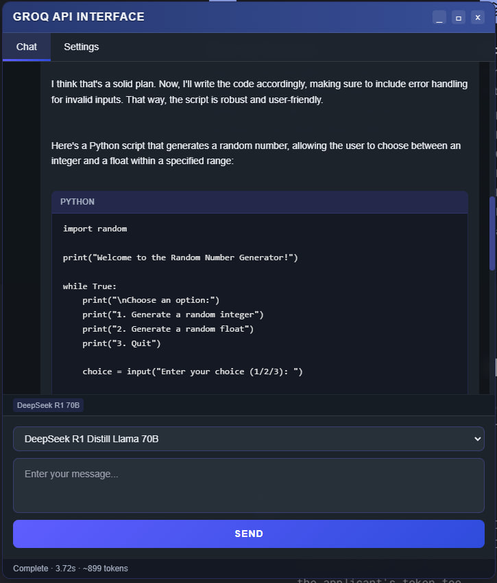

# Groq API Chrome Extension

A sleek, futuristic Chrome extension for interacting with the Groq API directly from any webpage. This extension provides a floating chat interface with powerful features for developers and AI enthusiasts.



## Features

- 🚀 **Floating UI**: Access Groq API from any webpage with a floating, resizable interface
- 🧩 **Multi-Model Support**: Switch between Groq's various models including:
  - Llama 3.3 70B Versatile
  - Llama 3.3 70B SpecDec
  - DeepSeek R1 Distill Llama 70B
  - Mixtral 8x7B
  - and more
- 🖌️ **Custom System Messages**: Set custom instructions for AI behavior
- 🔄 **Real-time Streaming**: Watch AI responses appear in real-time
- 📋 **Code Highlighting**: Beautiful formatting for code snippets with language detection
- 📊 **Response Metrics**: View response time and token usage statistics
- 🔍 **Customizable Parameters**: Adjust temperature and max tokens
- 🔒 **Secure API Key Storage**: Your API key is stored securely in Chrome's storage
- 🖱️ **Full Window Controls**: Resize from any direction, drag, maximize, minimize

## Installation

### From Chrome Web Store
1. Visit the [Chrome Web Store page](#) (coming soon???)
2. Click "Add to Chrome"

### Manual Installation (Developer Mode)
1. Download or clone this repository
2. Open Chrome and navigate to `chrome://extensions/`
3. Enable "Developer mode" in the top-right corner
4. Click "Load unpacked" and select the extension folder
5. The extension icon will appear in your toolbar

## Usage

1. Click the floating button in the bottom-left corner of any webpage
2. Go to the Settings tab and enter your Groq API key
3. (Optional) Configure a system message to customize AI behavior
4. Return to the Chat tab
5. Select your preferred model
6. Type your message and click Send
7. View the AI's response in real-time

## Key Controls

- **Resize**: Drag any edge or corner to resize the window
- **Move**: Drag the header to reposition the window
- **Maximize**: Click the square button to expand the window
- **Minimize/Close**: Hides the interface (click the floating button to show again)

## Customization

### System Message Templates
Use the quick templates or create your own custom system message to control how the AI responds:

- **Programmer**: "You are a helpful AI assistant specialized in programming."
- **Concise**: "You are a concise assistant. Provide short, direct answers."
- **Creative**: "You are a creative writer who responds with vivid descriptions and storytelling."

### Model Selection
Choose the right model for your needs:

- **Llama 3.3 70B Versatile**: Best for general-purpose tasks
- **Llama 3.1 8B Instant**: Faster responses for simpler queries
- **Mixtral 8x7B (32K)**: Supports longer contexts
- **DeepSeek R1 Distill**: Good balance of performance and speed

## Privacy

This extension:
- Stores your API key in Chrome's secure storage
- Only communicates directly with the official Groq API
- Does not collect or share your conversations
- Does not send your API key to any third-party servers

## Requirements

- A Groq API key (sign up at [groq.com](https://groq.com))
- Google Chrome browser or Chromium-based browsers (Edge, Brave, etc.)

## Development

### Project Structure
```
groq-api-extension/
├── manifest.json
├── content.js
├── styles.css
├── images/
│   ├── icon16.png
│   ├── icon48.png
│   └── icon128.png
└── screenshot.jpg
```

### Building from Source
1. Clone the repository
2. Make any desired modifications
3. Load as an unpacked extension in Chrome

## Acknowledgments

- [Groq](https://groq.com) for their powerful API
- [Lucide](https://lucide.dev) for icon inspiration

---

Made with ❤️ for the AI community